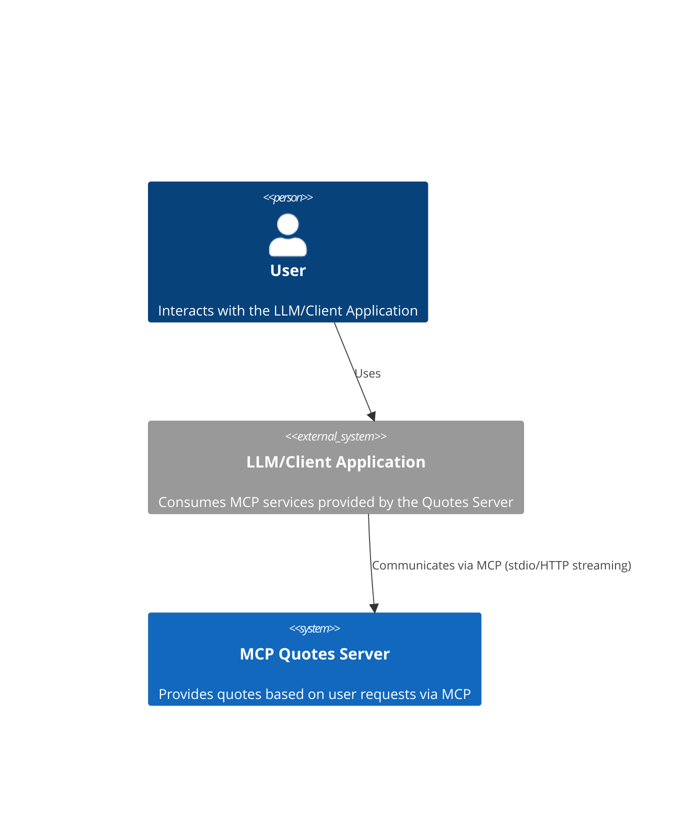
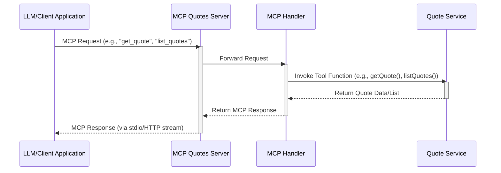

# Architecture Document: MCP Quotes Server

This document outlines the high-level architecture, technology stack, system structures, security guidelines, and overall test strategy for the MCP Quotes Server. This architecture is based on the Product Requirements Document (PRD) located at [`docs/PRD/MCP_Quotes_Server_PRD.md`](docs/PRD/MCP_Quotes_Server_PRD.md).

## 1. Technology Stack

The MCP Quotes Server is designed as a backend-only application, primarily serving as a Model Context Protocol (MCP) coding example. It does not include a traditional frontend or persistent database.

- **Backend Language:** TypeScript
- **Backend Framework/SDK:** Model Context Protocol TypeScript SDK
- **CI/CD Pipeline Tools:** GitHub Actions

## 2. Architectural Diagrams

The following diagrams are essential to represent the system's structure and interactions:

### 2.1. System Context Diagram

- **Purpose and Scope:** This diagram depicts the MCP Quotes Server as a black box, illustrating its interactions with external users and systems. It shows how external entities initiate requests and receive responses from the server, providing a high-level overview of the system's boundaries and its place within a larger ecosystem.



### 2.2. Component Diagram

- **Purpose and Scope:** This diagram details the main modules and their relationships within the monolithic TypeScript application. It breaks down the server into its logical components, such as the MCP handler, business logic modules, and any utility components, showing how they interact internally to fulfill requests.

```mermaid
C4Container
    Container(mcp_quotes_server, "MCP Quotes Server", "TypeScript Monolith", "Provides quotes based on user requests via MCP") {
        Component(mcp_handler, "MCP Handler", "TypeScript Module", "Receives and dispatches MCP requests to appropriate services.")
        Component(quote_service, "Quote Service", "TypeScript Module", "Contains business logic for generating and managing quotes.")
        Component(utility_module, "Utility Module", "TypeScript Module", "Provides common helper functions and utilities.")

        Rel(mcp_handler, quote_service, "Invokes quote generation/retrieval logic")
        Rel(quote_service, utility_module, "Uses helper functions")
    }
```

### 2.3. Sequence Diagram

- **Purpose and Scope:** This diagram illustrates a typical quote request/response flow through the MCP Quotes Server. It shows the order of operations and interactions between different components of the server, from receiving an incoming request (via stdio or streaming HTTP) to processing it and sending back a response, highlighting the data flow and method calls.



## 3. Backend Architecture & Structure

### 3.1. Architecture Style

The backend architecture is a **monolithic TypeScript application**. This choice is driven by its primary purpose as a minimal MCP coding example, where simplicity and ease of understanding are prioritized over distributed system complexities.

### 3.2. Backend Folder Structure

The primary backend folder structure will be organized to reflect the monolithic nature, with a focus on clarity for a coding example. Key modules will likely include:

- **`src/`**: Contains all source code.
  - **`handlers/`**: MCP tool handlers (e.g., `getQuote.ts`, `listQuotes.ts`).
  - **`services/`**: Business logic related to quotes (e.g., `quoteService.ts`).
  - **`utils/`**: Helper functions and common utilities.
  - **`index.ts`**: Main entry point for the MCP server.

### 3.3. Backend Service Communication

Communication with the MCP Quotes Server is primarily handled via **stdio (standard input/output)** or **streaming HTTP**. This is directly facilitated by the Model Context Protocol TypeScript SDK, which abstracts the underlying communication mechanisms. Data flow patterns will follow the MCP specification, where requests are received, processed by the relevant tool handlers, and responses are sent back through the established communication channel.

## 4. Frontend Architecture & Structure

This project does not include a traditional frontend. Interactions with the MCP Quotes Server are expected to be programmatic, typically from an LLM or another application utilizing the MCP.

## 5. Security Guidelines

Given that the MCP Quotes Server is designed as a local MCP coding example, the security considerations are minimal.

- **Authentication Methods:** None. The server is intended for local execution and direct interaction, not for public exposure requiring authentication.
- **Authorization Strategies:** None. Access control is not implemented as it's a local example.
- **Data Encryption:** Not applicable for data at rest. For data in transit, encryption depends on the underlying communication channel (e.g., HTTPS for streaming HTTP if configured, but not inherent to the local example).
- **Input Validation and Output Encoding:** Basic type checking will be implemented to ensure data integrity for MCP requests. Comprehensive input validation and output encoding for preventing web vulnerabilities are not a primary focus due to the local, non-web-facing nature.
- **Secrets Management:** Environment variables will be used for any minimal configuration that might be considered sensitive, though the example is designed to have very few such requirements.
- **API Security Best Practices:** Not applicable, as there is no traditional public API endpoint.
- **Plans for Addressing Common Vulnerabilities:** Minimal. Due to its local and example-oriented nature, the risk surface is significantly reduced. Manual code reviews will be the primary method for identifying obvious vulnerabilities.

## 6. Test Strategy

The testing strategy focuses on ensuring the correctness and functionality of the MCP Quotes Server's logic.

- **Unit Testing:**
  - **Framework:** Jest
  - **Approach:** Individual functions and methods within the business logic and utility modules will be tested in isolation to ensure their correctness.
- **Integration Testing:**
  - **Framework:** Jest
  - **Approach:** Tests will verify the interactions between different modules and the overall flow of MCP requests through the server, ensuring that components work together as expected.
- **End-to-End (E2E) Testing:** None. Given the backend-only nature and the focus on a coding example, full E2E testing with external clients is not planned.
- **Performance/Load Testing:** None. Performance is not a primary concern for this coding example.
- **Security Testing:** Manual review. Formal security testing (SAST, DAST) is not planned due to the minimal security surface and local nature.
- **Code Coverage Targets:** A target of **70%** code coverage will be aimed for to ensure a good level of test coverage for the core logic.
