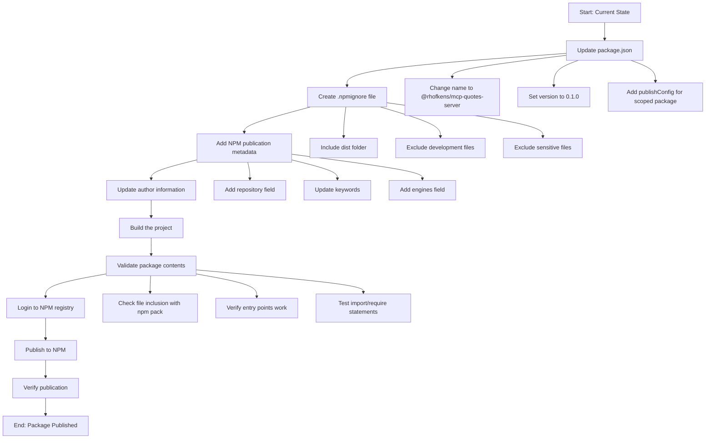

# NPM Package Publishing Plan for @rhofkens/mcp-quotes-server

## Overview
This document outlines the complete plan for publishing the MCP quotes server to the NPM registry as a scoped package with version 0.1.0.

## Current State Analysis
- **Package Name**: Currently `"mcp-quotes-server"` - needs to be scoped
- **Version**: Currently `"1.0.0"` - needs to be changed to `"0.1.0"`
- **Build System**: TypeScript with output to `dist/` folder
- **Issue**: `dist/` folder is in `.gitignore` but needed for NPM publication
- **Target**: Publish as `@rhofkens/mcp-quotes-server@0.1.0`

## Implementation Flow



## Detailed Implementation Steps

### Phase 1: Package Configuration Updates

#### Step 1: Update package.json
**File**: `package.json`
**Changes needed**:
- Change name from `"mcp-quotes-server"` to `"@rhofkens/mcp-quotes-server"`
- Update version from `"1.0.0"` to `"0.1.0"`
- Add `publishConfig` section for scoped package access
- Add proper `repository` field
- Update `author` field with your information
- Add `engines` field to specify Node.js version requirements
- Add `files` field to explicitly control what gets published
- Add `prepublishOnly` script for build validation

**Required additions**:
```json
{
  "name": "@rhofkens/mcp-quotes-server",
  "version": "0.1.0",
  "publishConfig": {
    "access": "public"
  },
  "repository": {
    "type": "git",
    "url": "https://github.com/rhofkens/mcp-quotes-server.git"
  },
  "author": "Roeland Hofkens <email@example.com>",
  "engines": {
    "node": ">=18.0.0"
  },
  "files": [
    "dist",
    "README.md",
    "LICENSE"
  ],
  "scripts": {
    "prepublishOnly": "npm run build && npm test"
  }
}
```

#### Step 2: Create .npmignore file
**File**: `.npmignore` (new file)
**Purpose**: Control what files are included in the NPM package
**Strategy**: Opposite of `.gitignore` - include `dist/` but exclude development files

**Content**:
```
# Source files (keep compiled dist)
src/
__tests__/
docs/

# Development files
*.test.ts
*.test.js
jest.config.js
eslint.config.js
.prettierrc
.prettierignore
tsconfig.json

# CI/CD and tooling
.github/
.vscode/
.roomodes

# Logs and temporary files
*.log
combined.log
errors.log
coverage/
.nyc_output/

# Environment files
.env*
!.env.example

# Development dependencies artifacts
.eslintcache
*.tsbuildinfo
node_modules/

# Package manager files
package-lock.json
yarn.lock

# Build artifacts that shouldn't be published
build/
temp/
tmp/
```

### Phase 2: Content Preparation

#### Step 3: Build Verification
**Commands**:
```bash
# Clean build
rm -rf dist/
npm run build

# Verify build output
ls -la dist/
```

**Verification checklist**:
- [ ] `dist/index.js` exists and is the main entry point
- [ ] `dist/start.js` exists for CLI usage
- [ ] All TypeScript files compiled correctly
- [ ] No TypeScript errors in build output

#### Step 4: Package Content Validation
**Commands**:
```bash
# Preview package contents without publishing
npm pack --dry-run

# Create actual package file for inspection
npm pack
```

**Validation checklist**:
- [ ] Package size is reasonable (< 1MB)
- [ ] `dist/` folder is included
- [ ] `README.md` and `LICENSE` are included
- [ ] Development files are excluded
- [ ] No sensitive files are included

### Phase 3: NPM Publication

#### Step 5: NPM Authentication
**Prerequisites**:
- NPM account with username `rhofkens`
- Proper authentication setup

**Commands**:
```bash
# Login to NPM (if not already logged in)
npm login

# Verify authentication
npm whoami
```

**Expected output**: Should show `rhofkens`

#### Step 6: Scoped Package Verification
**Commands**:
```bash
# Check if the scoped package name is available
npm view @rhofkens/mcp-quotes-server
```

**Expected**: Should return "npm ERR! 404 Not Found" (meaning name is available)

#### Step 7: Publication
**Commands**:
```bash
# Publish the package
npm publish

# Alternative with explicit tag
npm publish --tag latest
```

**Expected output**:
```
+ @rhofkens/mcp-quotes-server@0.1.0
```

### Phase 4: Post-Publication Verification

#### Step 8: Verify Publication Success
**Commands**:
```bash
# View published package information
npm view @rhofkens/mcp-quotes-server

# Check specific version
npm view @rhofkens/mcp-quotes-server@0.1.0
```

#### Step 9: Test Installation
**Commands**:
```bash
# Test installation in a temporary directory
cd /tmp
mkdir test-install
cd test-install
npm init -y
npm install @rhofkens/mcp-quotes-server

# Test import/require
node -e "console.log(require('@rhofkens/mcp-quotes-server'))"
```

## Troubleshooting Guide

### Common Issues and Solutions

#### Issue 1: Authentication Problems
**Symptoms**: "npm ERR! 403 Forbidden"
**Solutions**:
- Run `npm login` and re-enter credentials
- Check if 2FA is enabled and provide OTP
- Verify npm account email is confirmed

#### Issue 2: Scoped Package Access
**Symptoms**: "npm ERR! 402 Payment Required"
**Solutions**:
- Ensure `publishConfig.access` is set to `"public"`
- Verify the scope `@rhofkens` is available

#### Issue 3: Build Issues
**Symptoms**: TypeScript compilation errors
**Solutions**:
- Fix any TypeScript errors in source code
- Ensure all dependencies are installed
- Check `tsconfig.json` configuration

#### Issue 4: Package Size Too Large
**Symptoms**: Package > 1MB
**Solutions**:
- Review `.npmignore` to exclude more files
- Check for accidentally included large files
- Consider excluding documentation or test files

## Success Criteria Checklist

- [ ] Package name changed to `@rhofkens/mcp-quotes-server`
- [ ] Version set to `0.1.0`
- [ ] `.npmignore` file created with appropriate exclusions
- [ ] `package.json` updated with all required fields
- [ ] Project builds successfully (`npm run build`)
- [ ] Package contents validated (`npm pack --dry-run`)
- [ ] NPM authentication working (`npm whoami`)
- [ ] Package successfully published (`npm publish`)
- [ ] Package visible on npmjs.com
- [ ] Package can be installed (`npm install @rhofkens/mcp-quotes-server`)
- [ ] Main entry point works when imported
- [ ] Package size is reasonable

## Commands Summary

**Complete workflow**:
```bash
# 1. Build the project
npm run build

# 2. Preview package contents
npm pack --dry-run

# 3. Login to NPM (if needed)
npm login

# 4. Verify authentication
npm whoami

# 5. Publish the package
npm publish

# 6. Verify publication
npm view @rhofkens/mcp-quotes-server

# 7. Test installation
npm install @rhofkens/mcp-quotes-server
```

## Repository and Documentation Updates

After successful publication, consider:

1. **Update README.md** with installation instructions:
   ```markdown
   ## Installation
   ```bash
   npm install @rhofkens/mcp-quotes-server
   ```
   ```

2. **Add installation badge** to README.md:
   ```markdown
   [](https://www.npmjs.com/package/@rhofkens/mcp-quotes-server)
   ```

3. **Tag the release** in git:
   ```bash
   git tag v0.1.0
   git push origin v0.1.0
   ```

## Notes

- This is marked as version 0.1.0 to clearly indicate it's an example/learning package
- The scoped package approach (`@rhofkens/`) avoids naming conflicts
- All development files are excluded to keep the package size small
- The `prepublishOnly` script ensures the package is built and tested before publication